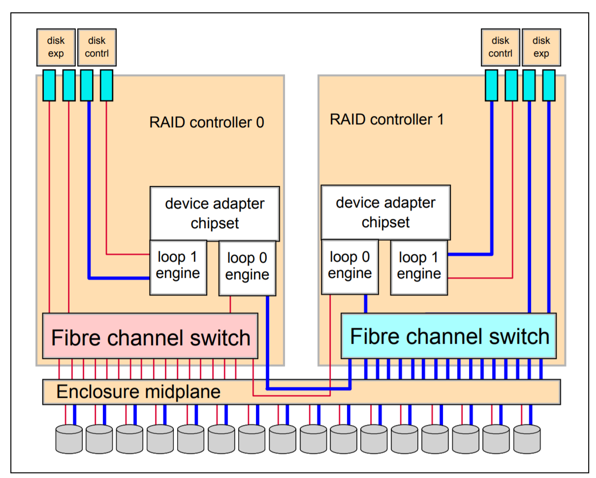

# Administration

Assuming two controllers up and running, make sure both are connected and can ping eachother. There is as previously discussed no ethernet backplane so you need to make sure they can do that or nothing will work.

*DS6800 FC connection Architecture, from IBM Redbook*

The above schematic is useful to keep in mind in how data flows from FCP/FICON to disks. They arrive at the disk array either on controller 1 or controller 2 and
can take the sub-optimal path through the other controller if they have to. It's important that you configure the array and the clients so that pathing is
done in an optimal way.

## Model Determination

I have what I think is a 522 controller and a 511 controller. The reason I believe that is because looking at /proc/cpuinfo I see 1.18 on one and 1.2 on the other, with MR1750K card ID reported as 0801 and 0702 respectively. I would love to hear about more ways to figure out the generation of controllers.

## Sanity Checking
Sanity checking runs a series of tests to ensure sanity of the configuration. You can either run it locally only by passing -current, or on both controllers. Beware that running on both controllers is quite slow as the current controller will SSH into the other controller for every check, which can take some time.

Example output:

```
[Mon Mar 07 05:58:59] root@noname:~ # smsanity -nc   

Sanity Checker v0.30 invoked on c1 (noname)
------------------------------------------ Kona 0 --------- Kona 1 ---------
Checking free memory...................... FAILED!          Passed           
Verifying RW partitions................... FAILED!          Passed           
Verifying Kona replacement is enabled..... FAILED!          Passed           
Checking running processes................ FAILED!          Passed           
Checking disk space....................... FAILED!          Passed           
Checking SBR status....................... skipped          skipped          
Verifying four online DA partitions....... FAILED!          Passed           
Verifying certain files do not exist...... Passed           Passed           
Verifying that LCPSS is in Dual mode...... FAILED!          FAILED!          
Verifying no open hardware problems....... FAILED!          FAILED!          
Verifying no open software problems....... FAILED!          FAILED!          
Checking file permissions................. FAILED!          Passed           
Verifying no open cabling problems........ FAILED!          Passed           
Verifying no open data loss problems...... FAILED!          Passed           
Checking symbolic links................... FAILED!          Passed           
Checking number of IML retries............ FAILED!          Passed           
Verifying no CF R/W errors................ FAILED!          Passed           
Scanning ranks............................ FAILED!          Passed           
Checking serials in ncipl (strict)........ FAILED!          FAILED!          
Checking serials in ncipl (vote).......... skipped          skipped          
Checking PDM ISS consistency.............. skipped          skipped          
Checking PDM corruption................... skipped          Passed           
Checking Pulled out BANJO................. FAILED!          Passed           
----------------------------------------------------------------------------

(*) Detailed information about the failed checks:

  date: Failed to execute '' on Kona 0
  memory: Kona 0: Failed to execute 'cat /proc/meminfo'
  mount-rw: Kona 0: Failed to execute 'busybox mount'
  kona-replacement: Kona 0: Remote file /lic/sm/bin/ncutils.conf does not exist or is not readable
  processes: Kona 0: Failed to determine which processes are running
  diskspace: Kona 0: Failed to execute 'df -a'
  4-dapart: Kona 0: Failed to execute 'df -a'
  dual-lcpss: Kona 0: Failed to execute catreef status/opmode
  dual-lcpss: Kona 1: Bad LCPSS status 'Single Cluster Operational'
  hw-problems: Kona 0: Failed to execute /lic/sm/bin/rss_displayProblem
  hw-problems: Kona 1: Open problem of type 0 (hardware) found, id=2005-01-01-00.54.48.548951
  sw-problems: Kona 0: Failed to execute /lic/sm/bin/rss_displayProblem
  sw-problems: Kona 1: Open problem of type 1 (software) found, id=2016-07-21-19.12.06.936383
  permissions: Kona 0: Failed to execute 'stat -c '%a' /persist/scratch'
  cabling-problems: Kona 0: Failed to execute /lic/sm/bin/rss_displayProblem
  dataloss-problems: Kona 0: Failed to execute /lic/sm/bin/rss_displayProblem
  sym-links: Kona 0: Failed to execute 'ls -l /dc /linuxrc /lic /home/shark/log /home/shark/tmp /home/shark/statesave /home/shark/config'
  num-iml-retries: Kona 0: Remote file /home/shark/config/imlretry does not exist or is not readable
  cf-rw-errors: Kona 0: Failed to execute 'grep _intr /var/log/messages | grep -v "grep" | wc -l'
  scanrank: Kona 0: Failed to execute 'dacmd -x scanrank'
  ncipl-strict: C0 serial number was found in only 2 files: /dapart/s1/ncipl.da,/dapart/s3/ncipl.da
Box serial number was found in only 2 files: /dapart/s1/ncipl.da,/dapart/s3/ncipl.da
C1 serial number was found in only 2 files: /dapart/s1/ncipl.da,/dapart/s3/ncipl.da
  pulled_out_banjo: Kona 0: Failed to execute /lic/sm/bin/rss_displayProblem

(*) This situation is OK for the following scenarios:

  - Node config status report
  - Nonconcurrent code load (before quiesce)
  - Concurrent code load (before quiesce)
```

# RAID details

You can use the utility `issraid` to explore the applied RAID configuration.

```
# Find out name of manager (seems to be always iss001 on kona 0, iss011 on kona 1)
issraid -M
# Show details on primary manager (kona 0)
issraid -Izl iss001
```

# Factory Reset

In order to factory reset, both controllers needs to be online and reach eachother. Do the following as root on the primary controller (Kona 0).

```
[Fri Jan 10 19:42:11] root@noname:~ # cmdmenu.pl 
+------------------------------------------------------------------------+
| Text Based Menu v0.03 running on noname                                |
+------------------------------------------------------------------------+
|  1) Clear Message Router Files                                         |
|  2) Check and Clear Failed Controller Flag (Window Files)              |
|  3) Display and Reset Controller Reboot Count (imlretry)               |
|  4) Display/Modify Controller Autoboot Flag (norsStart)                |
|  5) Delete Nonvolatile Write Cache Data (CST)                          |
|  6) Rebuild Configuration Database (Clean PDM)                         |
|  7) Delete Config and Return to Factory Defaults (Clear&Pave part 1/2) |
|  8) Delete Config and Return to Factory Defaults (Clear&Pave part 2/2) |
|  9) Force CPSS Dump                                                    |
| 10) PE_Package (...)                                                   |
| 11) Statesaves (...)                                                   |
| 12) Arrowhead_Dumps (...)                                              |
| 13) FTP a File (from current node)                                     |
| 14) Exit                                                               |
+------------------------------------------------------------------------+
>>> Your choice? 7
Fri Jan 10 19:43:26 2020 Begin Procedure: Delete Config and Return to Factory Defaults (Clear&Pave part 1/2)
Fri Jan 10 19:43:26 2020 /lic/sm/bin/clear_and_pave1.pl on kona 0
>>> Are you sure you want to delete all data (y/n)? y
*********************************************************************************
Fri Jan 10 19:43:33 2020 All data will be lost, this operation is not reversible!
*********************************************************************************
>>> To continue type 'continue and delete all data' (without the single quotes):  continue and delete all data
>>> Really? Are you *SURE* (y/n)? y
>>> Please enter your full name : something-clever-here-maybe
Fri Jan 10 19:44:00 2020 Shutting down LCPSS on kona 0
```

After a while you'll get asked to confirm a reboot. Do that, and after the reboot has finished and the console appears somewhat silent, continue the process.

```
[Fri Jan 10 19:51:10] root@noname:~ # cmdmenu.pl
+------------------------------------------------------------------------+
| Text Based Menu v0.03 running on noname                                |
+------------------------------------------------------------------------+
|  1) Clear Message Router Files                                         |
|  2) Check and Clear Failed Controller Flag (Window Files)              |
|  3) Display and Reset Controller Reboot Count (imlretry)               |
|  4) Display/Modify Controller Autoboot Flag (norsStart)                |
|  5) Delete Nonvolatile Write Cache Data (CST)                          |
|  6) Rebuild Configuration Database (Clean PDM)                         |
|  7) Delete Config and Return to Factory Defaults (Clear&Pave part 1/2) |
|  8) Delete Config and Return to Factory Defaults (Clear&Pave part 2/2) |
|  9) Force CPSS Dump                                                    |
| 10) PE_Package (...)                                                   |
| 11) Statesaves (...)                                                   |
| 12) Arrowhead_Dumps (...)                                              |
| 13) FTP a File (from current node)                                     |
| 14) Exit                                                               |
+------------------------------------------------------------------------+
>>> Your choice? 8
Fri Jan 10 19:51:22 2020 Begin Procedure: Delete Config and Return to Factory Defaults (Clear&Pave part 2/2)
Fri Jan 10 19:51:22 2020 /lic/sm/bin/clear_and_pave2.pl on kona 0
>>> Are you sure you want to continue with clear and pave (y/n)? y
***********************************************************************************************
Fri Jan 10 19:51:29 2020 This is Part 2/2 of the procedure, make sure you already did Part 1/2.
***********************************************************************************************
>>> Have you already ran clear and pave part 1? y
*********************************************************************************
Fri Jan 10 19:51:34 2020 All data will be lost, this operation is not reversible!
*********************************************************************************
>>> To continue type 'continue and delete all data' (without the single quotes):  continue and delete all data
>>> Really? Are you *SURE* (y/n)? y
>>> Please enter your full name : something-clever-here-maybe
Fri Jan 10 19:51:45 2020 daDestroyGD on kona 1
```

This will format all drives which will take a few hours likely.

# Licensing
There are some files that are interesting for licensing and product enablement. I haven't looked too much into this yet as my array is not fully up and running, but expect this section to grow. If you're so inclined, the code that handles feature activation seems to be called libSm.so and comes with debugging symbols baked in.

Files that are critical to licensing that I know so far is /persist/etc/fea${CHASSIS_SERIAL}.bin, /persist/etc/nc_mnta.cfg, and persist/etc/ncipl.da.

## MTS serial number

The serial number for DS6800 is shown in the SSH banner. This is an example:

```
 
                         IBM SystemStorage DS6000 (TM)
 
        1750 Model 511            SN 13-00715         Controller Card 1 (CL0)
 
 MCP 2007-06-26-203005         Code EC 5.2.2.514      Installed on: Sep 12 2010 
 
 
                                R11f.5b090514a 
                           SEA.rte level = 5.2.2-514
 
                   Licensed Internal Code - Property of IBM. 
 
                          1750 Licensed Internal Code 
             (C) IBM Corporation 1997, 2005.  All rights reserved. 
 
    US Government Users Restricted Rights - Use, duplication or disclosure 
          Restricted by GSA ADP Schedule Contract with IBM Corporation. 
```

The MTS (a.k.a. essID) serial number here is IBM.1750-1300715. When adding to DSSM it's the `1300715` you need to enter.
