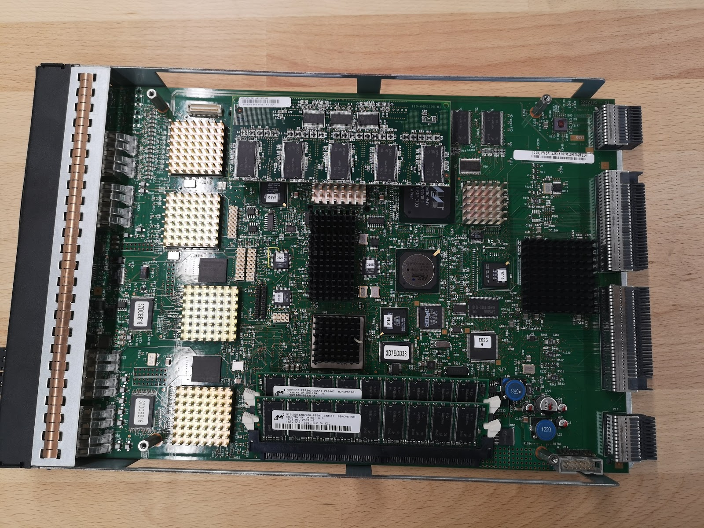
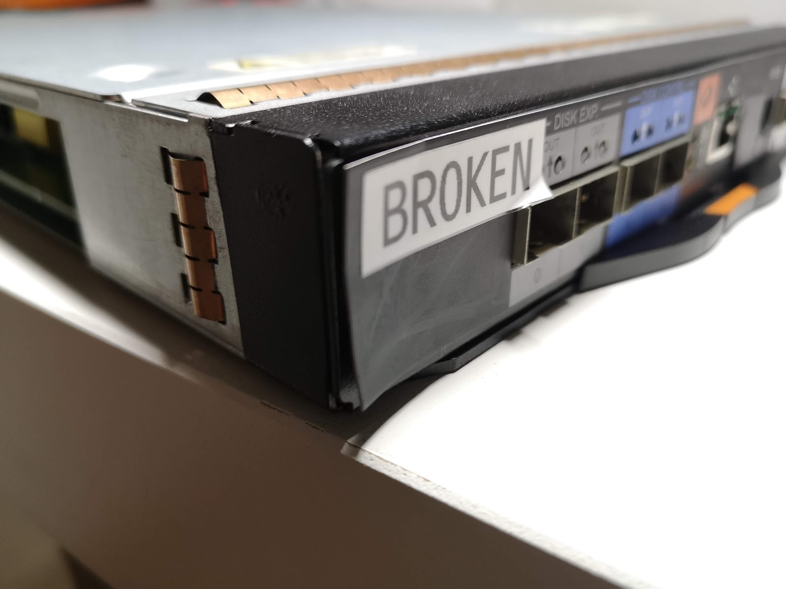
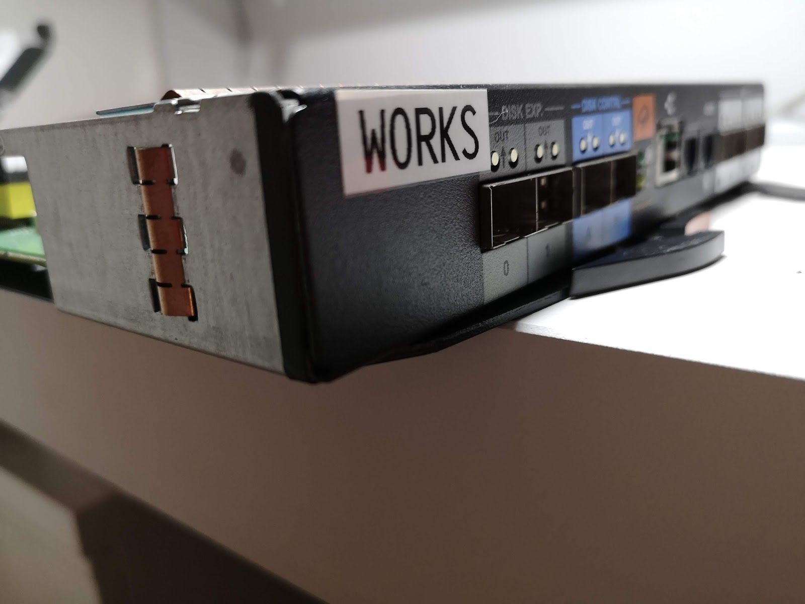
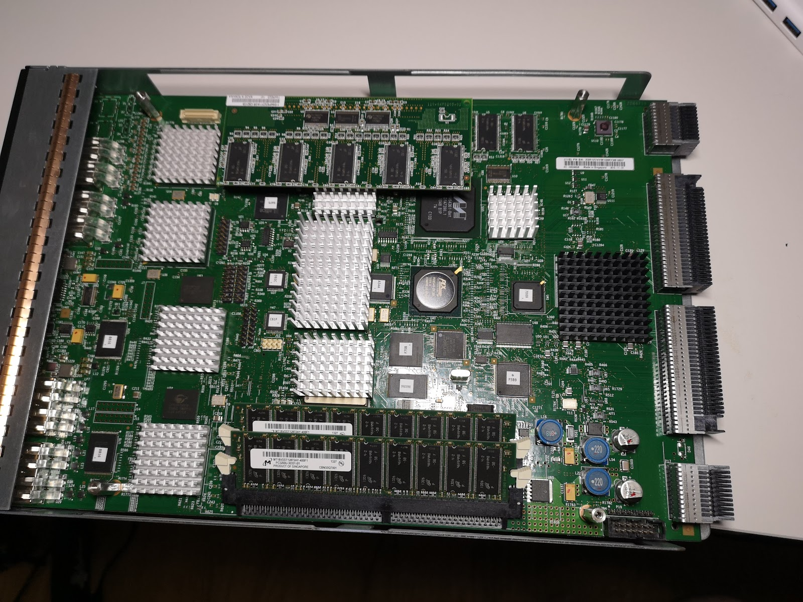
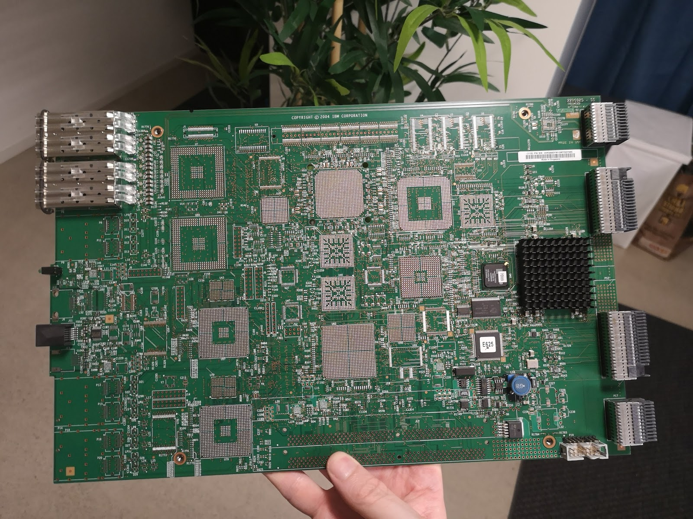
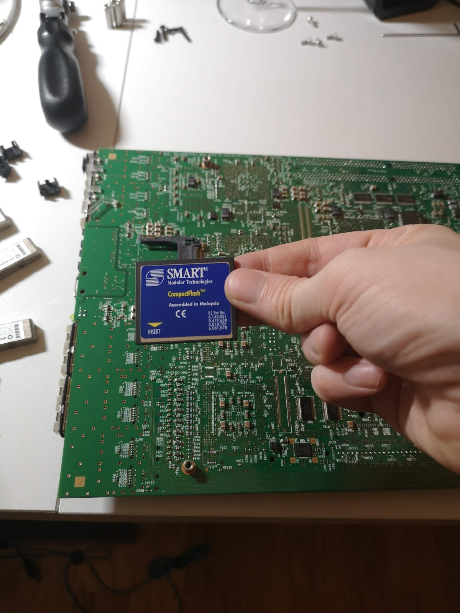
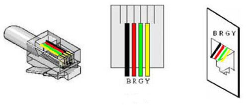

# Introduction

This is an knowledge base of various information about the IBM DS6800 that I hope will be useful if you ever need to repair one of these disk arrays.

The intention is for this post to be updated as new information becomes apparent or outdated. Right now the post is very much in a pre-alpha state and I hope to have more of a narrative down the road, but I thought it would be fun to share the story as it develops.


*The DS6800 controller, our patient*

For what it is worth, IBM calls the controllers and various other things sea related things which can be confusing. This is the translation for them:

| Word   | What                     |
|--------|--------------------------|
| Kona   | Controller               |
| Shark  | Unit                     |
| Reef   | Cluster of many units    |
| Sea    | Firmware                 |

## Chassis and Components

## Component Generations
There seems to be some notable differences between some generation of components - most likely 511/522. The parts seems to be compatible, but there are some notable differences that make e.g. the 45W9585 nicer. See the photos below where the 22R4876 is compared to the 45W9585 - notice the front panel which is glued onto the earlier and is prone to come off when opening it up and otherwise handling it.

*Fragile front on the 22R4876*

*Much nicer front on the 45W9585*

The controller itself has some different components and overall has a nicer look to it, so it is yet another point in the likely-a-later-generation column.

*The 45W9585 controller*

## Expansion Controller

*Expansion Controller*

Notice the gap in the backplane connection.

> The processor cards must be able to communicate with each other when the server enclosure is powered on.
> This means that there is no internal ethernet connection via the midplane. A peculiar design choice if you ask me.

## Chassis

List of useful part numbers 

| Part number	| FRU | What                             |
|-------------|-----|----------------------------------|
| 22R0077 | -       | Common Chassis                   |
| 22R6430 | 23R0470 | Main Controller                  |
| 22R4876 | 23R0471 | Main Controller                  |
| 23R1274 | 45W9585 | Main Controller (522?)           |
| 45W0119 | 23R0472 | Exp. Controller                  |
| 23R1275 | 23R0473 | Exp. Controller (EX2?)           |
| 22R3680 | unknown | Exp. Controller                  |
| 22R2198 | unknown | Exp. Controller                  |
| 22R2911 | -       | Rail kit                         |
| 23R0354 | -       | RS232 serial cable               |
| 24R1920 | -       | Common Midplane for 1750-511     |
| 96P1132 | -       | Rear Operator Panel              |
| 22R3807 | -       | 736W PSU                         |
| 22R5092 | 23R0247 | Battery Pack                     |
| 22R1291 | unknown | Battery Pack                     |
| 22R5944 | 22R5944 | 300GB 10K disk                   |

## Filesystem and Storage

The storage is rumored to be one of the biggest sources of pain on the DS6800. Thankfully the storage is slotted and removable, but sadly it is in the most inconvenient place imaginable. You might consider getting a CompactFlash extender, but I have no experience to share whether or not they work with this particular board.

Note when re-assembling the controller that the plastic LED light guide rods have a tendency to bend upwards, making the PCB ever so slightly not align with the screw holes. Pushing the light guides down one by one while gently apply pressure to push the PCB in I have found works for me.


*The CompactFlash location, underneath the controller*

Partition table:
| Partition	| Mount        | Usage                        |
|-----------|--------------|------------------------------|
| hda1 |  /var/log         | Log data (shared)            |
| hda2 |  -                | Extended partition           |
| hda5 |  /other/          | Root partition B             |
| hda6 |  /other/other_lic | License partition B          |
| hda7 |  /                | Root partition A             |
| hda8 |  /curr_lic        | License partition A          |
| hda9 |  /persist         | Persistent data (shared)     |

This is the mount table for reference:
```
LABEL=current    /                ext3    noatime  0 1
LABEL=curr_lic   /curr_lic        ext3    noatime  0 2
/dev/hda9        /persist         ext3    noatime  0 2
/dev/hda1        /var/log         ext3    noatime  0 2
LABEL=other      /other           ext3    noatime,noauto 0 0
LABEL=other_lic  /other/other_lic ext3    noatime,noauto 0 0
```

The CF cards that I have tested with and the result:

| Card                                                                       | Result               |
|----------------------------------------------------------------------------|----------------------|
| Transcend Compact Flash Card 2GB MLC (2GB) [TS2GCF133]                     | System hang          |
| Sandisk Extreme Compact Flash (32GB) [SDCFXSB-032G-G46]	                   | System reboot loop   |
| SMART Industrial Compact Flash 2GB (S-Series) [SG9CF2GSMBxx]               | System reboot loop   |
| Swissbit 4GB Compact Flash SLC C-500 I-TEMP [SFCF4096H1AF2TO-I-QT-517-STD] | System reboot loop   |
| SMART IBM-model Compact Flash 2GB (H-Series) [SG9CF2GHYAAIBM]              | Works                |
| SMART Compact Flash 2GB (unknown model) [SM9FLACF2048D4]                   | Works                |

When the system does not like the particular CF card you get messages that look like this:
```
CF: 
     Data:    0x7473
     Error:   0x00
     SectCnt: 0x17
     SectNum: 0xD8
     CylLow:  0x3C
     CylHi:   0x42
     Drive/Hd:0xE0
     Status:  0x58
     AltStat: 0x58
 CF Not Being reset -- operation in progress?
*message repeats but system is alive, SEGV happens and system reboots*
```

and possibly messages like these:

```
CF: 
     Data:    0xEBDB
     Error:   0x00
     SectCnt: 0x1B
     SectNum: 0xB7
     CylLow:  0xC6
     CylHi:   0x03
     Drive/Hd:0xE0
     Status:  0x58
     AltStat: 0x58
 CF Not Being reset -- operation in progress?

hda: lost interrupt
hda: lost interrupt
hda: lost interrupt
*message repeats and system is hung*
```

One hypothesis was that this is related to the cards are trying to use (U)DMA but the wiring of the CF socket might be only for PIO. This page has some information about why this might be a problem. However as the SG9CF2G card also fails this is probably not true as it does not support DMA from what I can tell.

## Serial Console

The connector is an RJ11 with 6P4C pin configuration.

*RJ11 pin color mapping*

The pinout for a converter between the RJ11 6P4C male to a DB-9 female is like this:

* Yellow (RJ11 pin 5)  to DB-9 pin 2
* Red (RJ11 pin 3) to DB-9 pin 5
* Black (RJ11 pin 2) to DB-9 pin 3

Connect using 38400 baud, 8n1, and no flow control.

If you take the CompactFlash out and and check the filesystem you can easily find the shadow file. To save you the trouble and power to crack them, these are the passwords:

| Username        | Password    |
|-----------------|-------------|
| root            | kimelm@n    |
| tester          | t3ster      |
| level3          | tucs0n      |
| level2          | level2      |
| level1          | level1      |
| serial          | serial      |
| guest           | guest       |
| cl              | cl          |
| copyforcustomer	| **unknown** |
| mfg             | **unknown** |

You can also get into the initrd if you want to do some other recovery or password resetting. This is done by typing the passphrase "r33f" when the "Loading Initrd..." is displayed.

```
Freeing initrd memory: 4096k freed
VFS: Mounted root (ext2 filesystem).
Mounting /proc filesystem
Loading Initrd...r33f
12: Terminated
Success, response match.


BusyBox v0.60.5 (2006.07.26-22:08+0000) Built-in shell (ash)
Enter 'help' for a list of built-in commands.

sh: can't access tty; job control turned off
#
```

This allows you to mount the root file system over NFS if you want:

```
# Become pid 1
rm /sbin/init
echo '#!/bin/ash' > /sbin/init
echo 'exec /bin/ash' >> /sbin/init
chmod +x /sbin/init
echo 0x0100 > /proc/sys/kernel/real-root-dev
umount /proc
exit
# - Make sure to use the IP the machine expects
# - Ensure /etc/fstab is empty and exit 0 is in top of etc/init.d/boot.localfs
# - Disable interface flapping in lic/bin/network.nc lines 217-223
mount -t proc none /proc
insmod modules/smc91111.o
ifconfig eth0 10.1.3.90 netmask 255.255.255.0
ifconfig eth0 up
route add default gw 10.1.3.254
mkdir /root
mount -t nfs -o nolock,tcp 10.0.200.48:/srv/export/ds6800/ctrl2 /root
# This is done to make the sanity check a bit happier
mount -t nfs -o nolock,tcp 10.0.200.48:/srv/export/ds6800/ctrl2/persist /root/persist
mount -t nfs -o nolock,tcp 10.0.200.48:/srv/export/ds6800/ctrl2/var/log /root/var/log
cd /root
/sbin/pivot_root . initrd
exec /sbin/init
```

The initrd seems to be obfuscated using a program called "foo" and I am not sure if it is stored in the zImage yet or written to some obscure flash portion - probably it is just in the zImage. Since it is not trivial to change the initrd I have not endeavoured to make NFS booting permanent, so running the system like this is not ideal as you would have to catch every reboot manually.

## Disk Compatibility

Inserting a HP 300G / 15K FC-AL drive into the backplane works and the drive powers on, so likely with some software modification the array can be made to work with other drives.

# Further Reading

IBM usually makes some great documentation, and this is true here as well. I recommend these links in particular.

 * [IBM System Storage DS6000 Series: Architecture and Implementation](http://www.redbooks.ibm.com/abstracts/sg246781.html?Open)
 * [IBM TotalStorage DS6000 Installation, Troubleshooting, and Recovery Guide](http://ps-2.kev009.com/rs6000/manuals/SAN/DS6000/IBM_TotalStorage_DS6000_Installation,_Troubleshooting,_and_Recovery_Guide_GC26-7678-05.pdf)
 * [Kevin Bowling's excellent documentation mirror](http://ps-2.kev009.com/rs6000/manuals/SAN/DS6000/)
